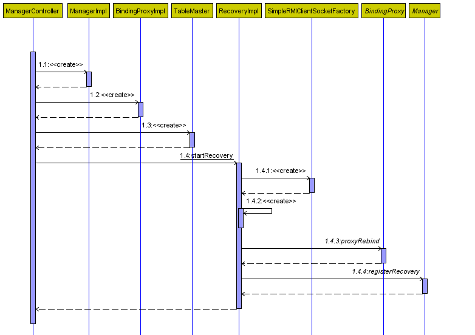
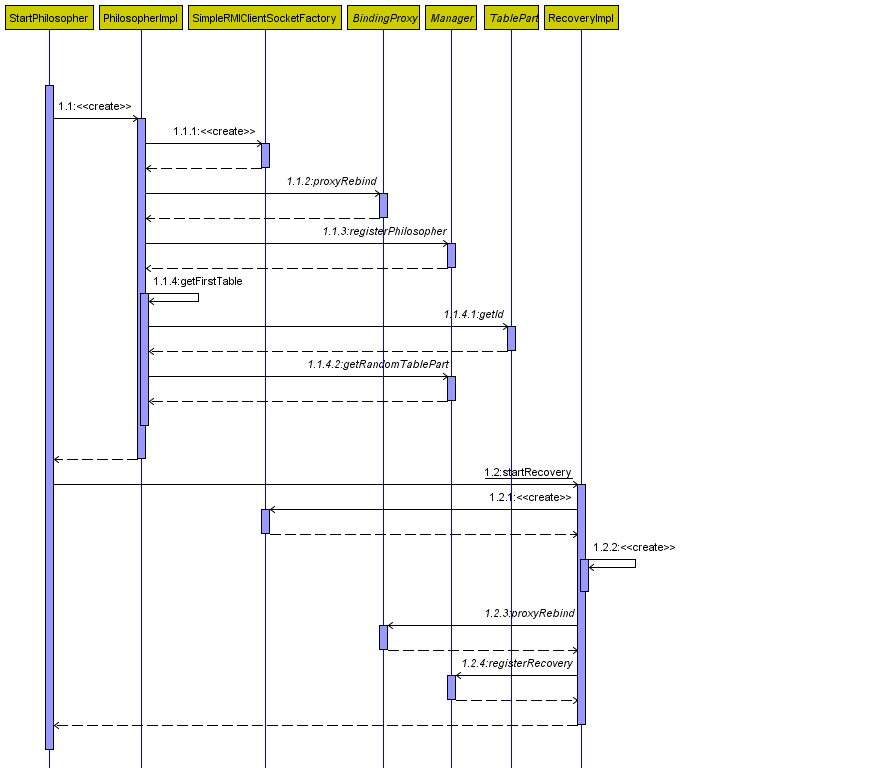
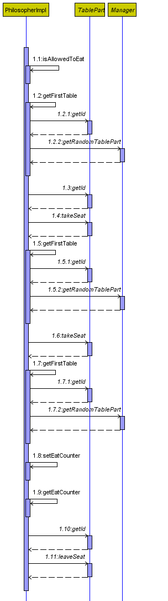

# Aufgabe 4.2 a

Fragen zum Programmdesign:

## Wie werden Philosophen, Plätze, Gabeln, programmtechnisch abgebildet?

### Philosophen

Wie bereits in Aufgabe 3.3 wird jeder Philosoph als eigener Thread implementiert.
Für die Verteilung ist jeder Philosoph zusätzlich als Remote-Objekt implementiert um eine Schnittstelle für den Table-Master und entferntes
starten und stoppen sowie die Wiederherstellung anzubieten.

### Plätze, Gabeln

Der gesamte Tisch wird in mehrere TableParts aufgeteilt. Jeder TablePart besteht aus zwei Plätzen mit zwei Gabeln und erhält eine Referenz
auf den nächsten TablePart vom Manager zugewiesen, wodurch der Tisch geschlossen wird. TableParts können auf unbegrenz vielen unterschiedlichen
Rechnern gestartet werden.

Im Gegensatz zu Aufgabe 3.3 mussten die Gabeln für die verteilten Philosophen als eigeninterpretation des ReentrantLocks neu implementiert werden,
da der ReentrantLock im RMI-Kontext sich nicht gleich verhält. Jede Gabel kann von einem Philosophen gesperrt werden. Die Sperre wird durch
das setzen der ID des Philosophen auf der Gabel erreicht.
Wenn ein Philosoph prüft, ob eine Gabel für ihn frei ist, wird zudem überprüft, seit wann die Gabel gesperrt ist. Wenn eine Gabel länger 
als das fünffache der Essenszeit eines Philosophen blockiert ist, wird davon ausgegangen, dass der besitzende Philosoph beendet wurde/abgestürzt ist,
und die Gabel automatisch wieder freigegeben.

## Wie kann die Verteilung, die Kommunikation und Synchronisation sinnvollerweise erfolgen?

In dieser Architektur erfolgt die Kommunikation über RMI. Jeder Philosoph und TablePart kann auf einer physikalisch entfernten Maschine gestartet werden,
solange eine Verbindung zum Manager-Rechner besteht. Es wurde eine zentrale Lösung implementiert, das heißt, dass es eine zentrale RMI-Registry gibt,
auf deren Rechner auch der Manager laufen sollte.

Die Synchronisation erfolgt an zwei Stellen zu unterschiedlichen Zwecken.

Auf den Gabeln kann immer nur ein Philosoph sperren/entsperren um die Synchronisation der Platzreservierung zu Gewährleisten.
Zusätzlich wird zur Verwaltung aller registrierten Remote-Objekte eine synchronisation beim registrieren und deregistrieren im Manager 
auf den Listen der registrierten Objekten durchgesetzt.

## Wie können Verklemmungen vermieden oder erkannt und aufgelöst werden?

Wie bereits in Aufgabe 3.3 wird eine Verklemmung dadurch verhindert, dass ein Platz erst eingenommen werden kann wenn beide Gabeln eines
Platzes direkt zur verfügung stehen. Im Fall der verteilten Philosophen wird zudem noch eine Verklemmung durch "absterben" eines Philosophen
durch die im oberen Teil beschriebene zeitliche begrenzung des Sperren einer Gabel verhindert.

# Ablaufdiagramme

